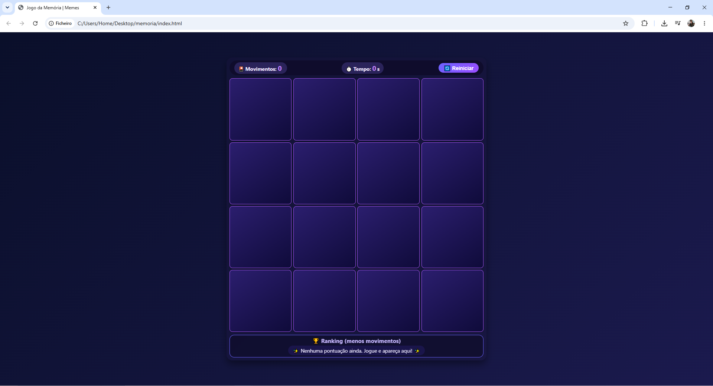
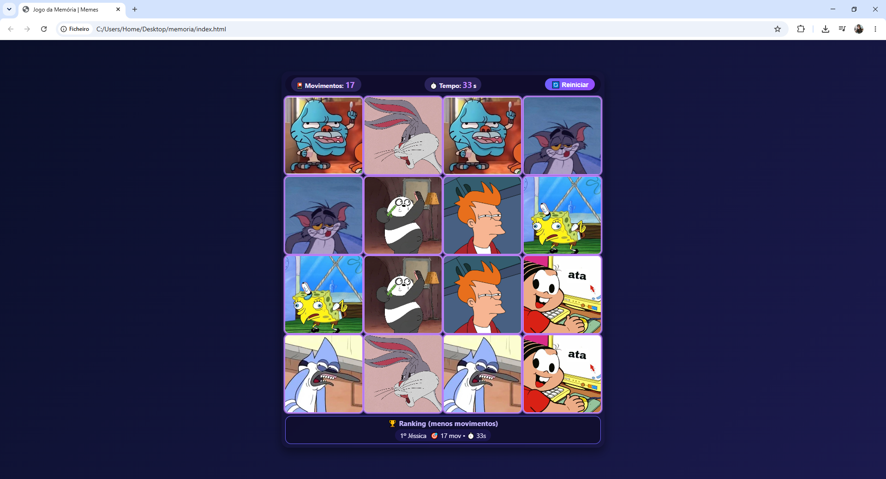

# 🧠 Jogo da Memória – Tema Personalizável

> Um jogo da memória interativo, responsivo e com ranking local. Desenvolvido com HTML5, CSS3 e JavaScript puro para demonstrar habilidades em manipulação de DOM, lógica de estado, animações CSS e persistência de dados.

 
  

---

## 🎯 Funcionalidades

-  **Grid 4×4** com 8 pares de cartas (você pode usar suas próprias imagens)
-  **Efeito Flip 3D** nas cartas (rotação suave)
-  **Timer** que começa apenas no primeiro clique (não conta tempo parado)
-  **Contador de movimentos** para medir seu desempenho
-  **Ranking local** – salva as 5 melhores pontuações no seu navegador (usando `localStorage`)
-  **Botão Reiniciar** – embaralha as cartas e zera o placar
-  **Design responsivo** – funciona em desktop, tablet e celular
-  **Feedback visual** – quando você acerta um par, as cartas ganham um brilho roxo
-  **Código limpo** – fácil de entender e modificar

---

## 🛠️ Tecnologias utilizadas

| **HTML5** | Estrutura semântica da página |
| **CSS3** | Flexbox, Grid, animações 3D (`perspective`, `transform`), media queries |
| **JavaScript ** | Manipulação de DOM, eventos, `setInterval`, `localStorage`, lógica de estado |
| **LocalStorage** | Persistência do ranking localmente |

> Nenhuma biblioteca externa – tudo feito com **JavaScript puro** e **CSS customizado**.

---

## 🚀 Como executar o projeto

### 1. Clone o repositório ou baixe os arquivos

git clone https://github.com/seu-usuario/jogo-memoria.git
cd jogo-memoria

📁 Estrutura do projeto

jogo-memoria/
│
├── index.html          
├── style.css           
├── script.js           
├── imagens/            
│   ├── foto1.jpg
│   ├── foto2.jpg
│   ├── foto3.jpg
│   ├── foto4.jpg
│   ├── foto5.jpg
│   ├── foto6.jpg
│   ├── foto7.jpg
│   └── foto8.jpg
└── README.md        

🔗 Links

Meu LinkedIn: linkedin.com/in/jessica-oliveira-frontend/

E-mail para contato: jessicaoliverfaria@gmail.com

